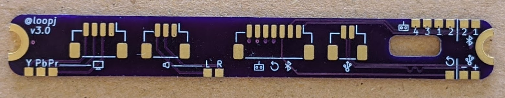
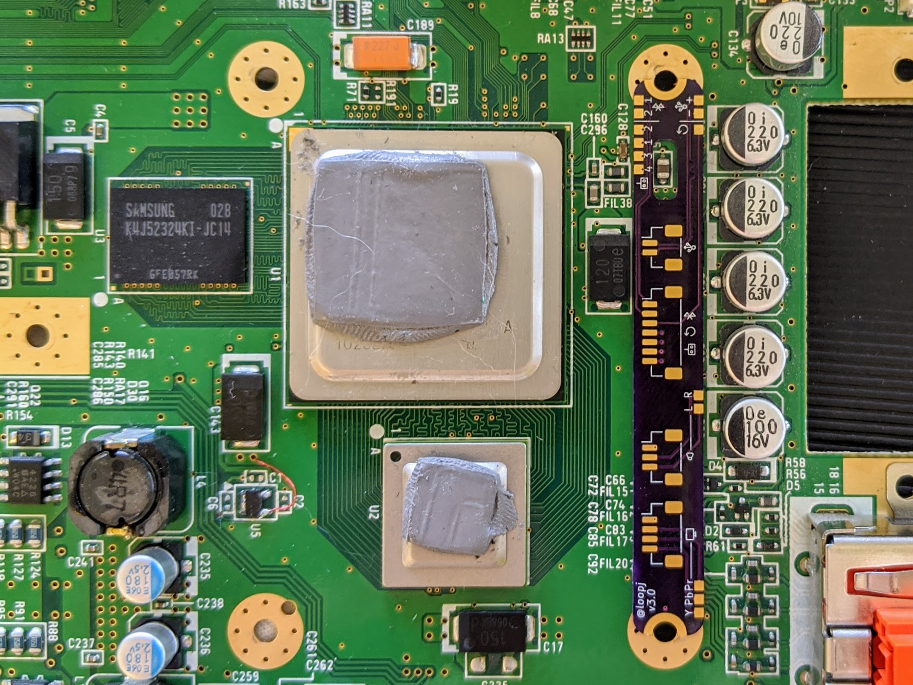
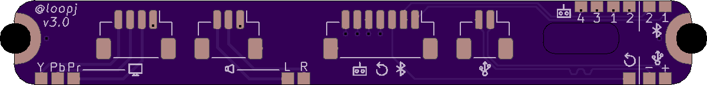
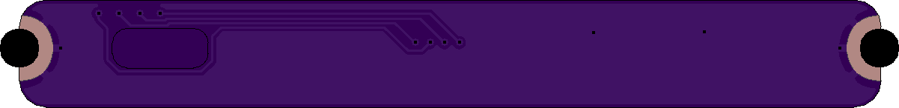

# Wii Motherboard Breakout PCB

Wii motherboard breakout board for USB, Bluetooth, GameCube controllers, A/V, and RST lines.

This is designed to be permanently mounted to a (trimmed) Wii motherboard to give access to peripheral data lines without having to worry about breaking small wires. I designed this allow me to rapidly prototype "daughterboard" peripheral PCBs without having to de-solder/re-solder.

Useful for prototyping, or for permanent installation on Wii projects which are mounted with the CPU/GPU facing up (probably not most portables).

## Features
- Pads aim to be as close to onboard vias as possible
- Designed to lay flush with 4-layer Wii motherboards
- Cutout for capacitor (C56)
- Can be screw mounted (M2 or M2.5 screws), glued, or soldered
- Castellated mounting holes
- Footprints for vertical JST-SH headers
- Breaks out:
    - USB (D-, D+)
    - Audio (L, R, GND)
    - Component/RGB Video (Y, Pb, Pr, GND)
    - Bluetooth (D1, D2)
    - GameCube Controllers x4 (SI line)
    - Reset Line

## Gerber Files

See [releases](https://github.com/loopj/wii-breakout/releases).

## Order from OSH Park

https://oshpark.com/shared_projects/xyI6Kvkf

## Photos
### Board photo

### Motherboard placement

## PCB renders
### Front

### Back
